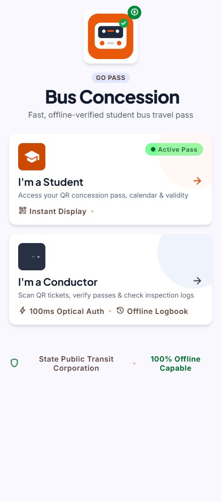
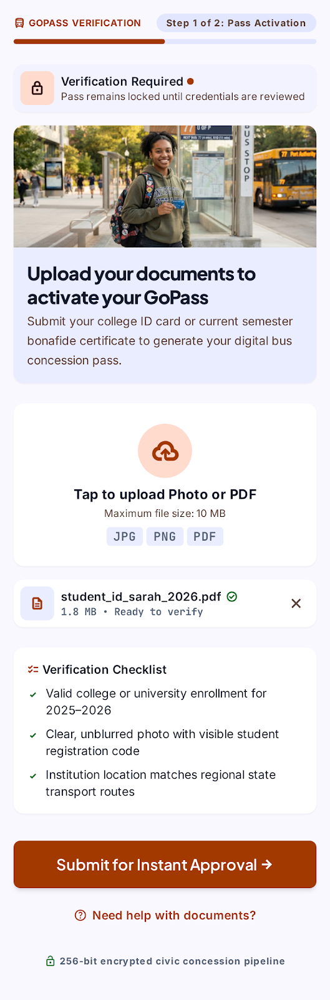
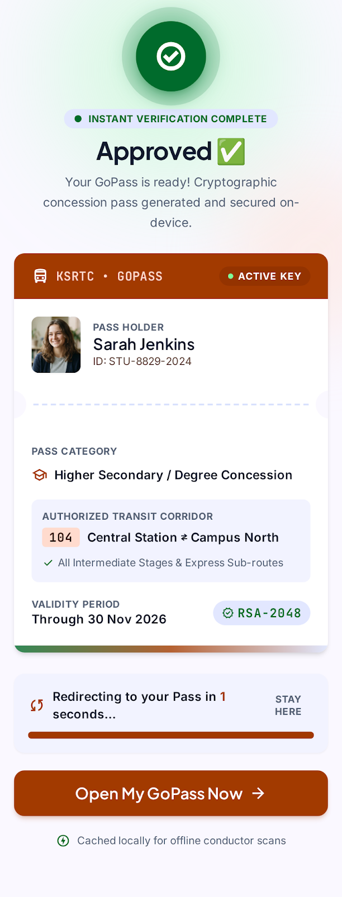
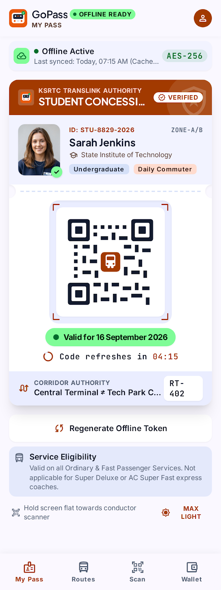
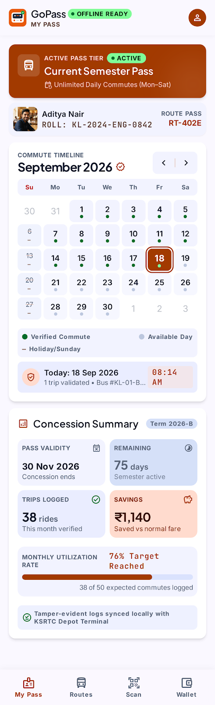
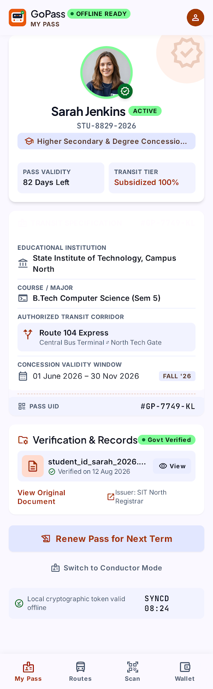
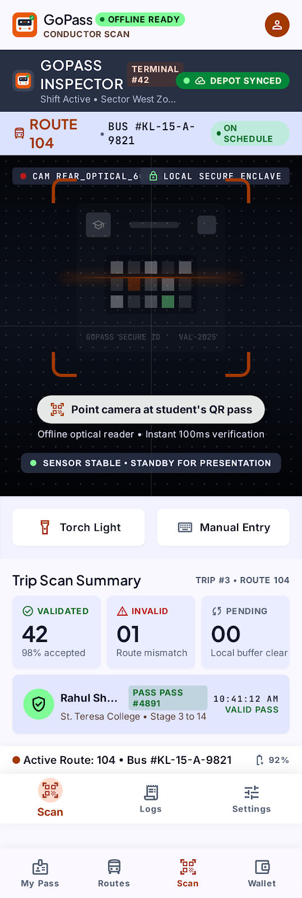
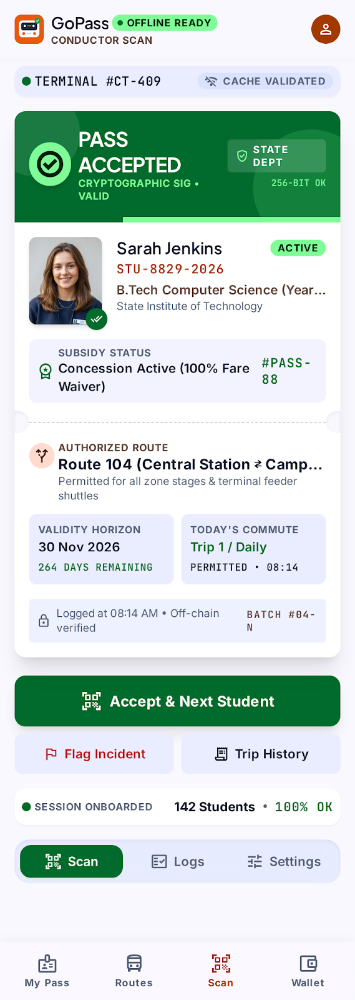
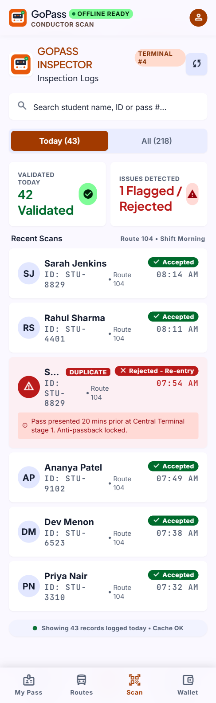
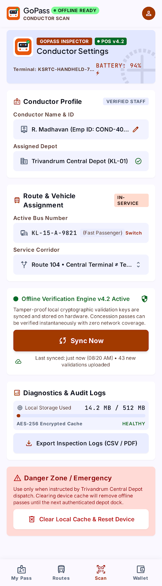

# 🚌 GoPass — Offline Dynamic-QR Student Bus Concession Verification

[](https://www.typescriptlang.org/)
[](https://react.dev/)
[](https://vitejs.dev/)
[](https://tailwindcss.com/)
[](https://web.dev/progressive-web-apps/)
[](https://vercel.com/)

**GoPass** is a civic-grade, offline-first web application designed for transit systems to verify student bus-concession passes with **zero network connectivity** (no Wi-Fi, no mobile data, no backend server round-trips).

It provides a dual-role interface:
1. **Student Mode**: Presents a daily cryptographic QR code signed via **HMAC-SHA256**, concession calendar, and student profile.
2. **Conductor Mode**: Uses the device camera for 100ms optical scanning, executes a 6-step offline validation pipeline, tracks real-time inspection logs, and handles sync states.

---

## 📸 Screenshots & UI Showcase

### 1. Role Selection & Student Onboarding Gate
| Role Selection Landing | Document Upload Gate | Instant Approval Confirmation |
|:---:|:---:|:---:|
|  |  |  |

---

### 2. Student Dashboard
| Dynamic QR Pass (My QR) | Commute Calendar | Student Profile |
|:---:|:---:|:---:|
|  |  |  |

---

### 3. Conductor Inspection & Validation
| Optical Camera Scanner | Pass Validation Result | Offline Inspection Logs | Terminal Settings |
|:---:|:---:|:---:|:---:|
|  |  |  |  |

---

## ⚡ Key Technical Architecture

### 1. The Dynamic QR Token Scheme (HMAC-SHA256)
Rather than simple plaintext IDs (which can be easily forged), GoPass utilizes symmetric HMAC-SHA256 computed on-device with the native **Web Crypto API** (`crypto.subtle`):

```json
{
  "sid": "S001",
  "date": "2026-09-18",
  "nonce": "A82F91C4",
  "mac": "b64-encoded-HMAC-SHA256(sid|date|nonce, studentSecret)"
}
```

- **Date-Bound**: QR is valid only for today's local date. Yesterday's QR is automatically invalid.
- **Dynamic Nonce**: Every manual regeneration or daily tick creates a new random nonce and recomputed MAC, changing the QR visually while preserving validity.
- **Pre-Seeded Shared Secret**: Both the student's phone and conductor's terminal hold the student's key material in local IndexedDB (`Dexie.js`), enabling instant offline cryptographic verification.
- **Constant-Time Comparison**: MAC validation uses constant-time string comparison to eliminate side-channel timing attacks.

---

### 2. Conductor Validation Pipeline (§6.3)
When the conductor scans a QR code, it short-circuits on the first failure in this exact sequence:

```mermaid
graph TD
    A[Scan QR Code] --> B{1. Valid JSON Schema?}
    B -- No --> R1[❌ Rejected: Invalid QR]
    B -- Yes --> C{2. Student in Roster?}
    C -- No --> R2[❌ Rejected: Unknown student]
    C -- Yes --> D{3. HMAC Signature Valid?}
    D -- No --> R3[❌ Rejected: Invalid QR / Tampered]
    D -- Yes --> E{4. Token Date === Today?}
    E -- No --> R4[❌ Rejected: Expired QR / Wrong Date]
    E -- Yes --> F{5. (SID, Date) Already Accepted Today?}
    F -- Yes --> R5[❌ Rejected: Already used today]
    F -- No --> G{6. Concession Validity Window Active?}
    G -- No --> R6[❌ Rejected: Concession expired]
    G -- Yes --> H[✅ Accepted: Write Log & Mark Calendar Date]
```

---

## 🛠️ Tech Stack

| Layer | Technology | Purpose |
|---|---|---|
| **Framework** | React 18 + TypeScript | UI Components & state management |
| **Build Tool** | Vite 6 | Lightning-fast dev server and static bundling |
| **Styling** | Tailwind CSS | Custom transit tokens, typography & tactile UI |
| **Offline Storage** | Dexie.js (IndexedDB) | Storage for Student Roster, Scan Records, Settings |
| **QR Generation** | `qrcode.react` | Zero-network SVG QR rendering |
| **QR Scanning** | `html5-qrcode` | Camera viewfinder & live optical QR decode |
| **Cryptographic Engine**| Web Crypto API (`crypto.subtle`) | Zero-dependency native HMAC-SHA256 |
| **PWA / Service Worker**| `vite-plugin-pwa` (Workbox) | Offline precaching & installable mobile app |
| **Hosting Target** | Vercel | Static hosting with SPA rewrites |

---

## 📁 Project Structure

```
gopass/
├── public/
│   ├── favicon.svg             # Transit bus logo
│   └── manifest.webmanifest    # PWA configuration
├── src/
│   ├── crypto/
│   │   └── hmac.ts             # Web Crypto HMAC-SHA256 & nonce helpers
│   ├── db/
│   │   ├── db.ts               # Dexie IndexedDB instance & indexes
│   │   ├── students.ts         # Student model interface
│   │   ├── scans.ts            # ScanRecord model interface
│   │   ├── settings.ts         # ConductorSettings model interface
│   │   └── seed.ts             # 5 pre-loaded demo students & settings
│   ├── qr/
│   │   ├── generateToken.ts    # Dynamic QR payload builder & signer
│   │   └── validateToken.ts    # Conductor-side 6-step validation pipeline
│   ├── modes/
│   │   ├── student/
│   │   │   ├── StudentDashboard.tsx
│   │   │   ├── StudentOnboardingGate.tsx # Simulated ~5s document approval
│   │   │   ├── MyQR.tsx        # Dynamic QR ticket with countdown ring
│   │   │   ├── Calendar.tsx    # Commute history & subsidy metrics
│   │   │   └── Profile.tsx     # Student credentials & document metadata
│   │   └── conductor/
│   │       ├── ConductorDashboard.tsx
│   │       ├── ScanQR.tsx      # Camera scanner + 1-click test simulators
│   │       ├── ScanResultCard.tsx # Accepted / Rejected modal card
│   │       ├── Logs.tsx        # Searchable logs & JSON export
│   │       └── Settings.tsx    # Conductor info, sync button & cache purge
│   ├── components/
│   │   └── RoleSelection.tsx   # Landing screen with student picker
│   ├── App.tsx                 # Role routing & state persistence
│   ├── main.tsx                # Entry point
│   └── index.css               # Design system styling & fonts
├── index.html
├── tailwind.config.js
├── vite.config.ts
└── vercel.json                 # SPA static rewrite config
```

---

## 🚀 Getting Started

### Prerequisites
- Node.js (v18 or higher)
- npm or yarn

### Installation & Local Run
```bash
# 1. Clone the repository
git clone https://github.com/your-username/gopass.git
cd gopass

# 2. Install dependencies
npm install

# 3. Start local development server
npm run dev
```

Visit `http://localhost:5173` in your browser.

---

## 📱 Interactive Demo Walkthrough

You can test GoPass either using **two phones side-by-side** or on a **single device/laptop**:

1. **First-Time Student Onboarding**:
   - Open the app and select **"I'm a Student"** (Sarah Jenkins - `S001`).
   - The app opens into the locked **Document Upload Gate**.
   - Tap **"Submit for Instant Approval"** → Watch the simulated 5-second verification pipeline → Celebrate with the **Approved ✅** screen.
2. **Display Dynamic QR**:
   - View Sarah's active pass with today's date badge and countdown timer.
3. **Conductor Optical Scan**:
   - Open another tab / phone in **"I'm a Conductor"** mode.
   - Scan Sarah's QR code using the camera (or click **Test Presets** → **1. Valid Pass**).
   - Instant **PASS ACCEPTED ✅** dialog appears and logs to IndexedDB.
4. **Anti-Replay Testing**:
   - Scan the same QR code a second time.
   - Instant **PASS REJECTED ❌ (Already used today)** prevents reuse.
5. **Dynamic Token Regeneration**:
   - On the student phone, tap **"Regenerate Offline Token"**.
   - A fresh nonce and MAC are signed, producing a visually different QR.
   - Conductor scans the new token → **ACCEPTED ✅**.
6. **Testing Edge Cases & Rejections**:
   - Open Conductor Scanner → **Test Presets**:
     - *Tampered Signature* → ❌ `Invalid QR`
     - *Expired Date* → ❌ `Expired (wrong date)`
     - *Expired Concession Period* (Arun Kumar `S003`) → ❌ `Concession expired`
     - *Unregistered Student* → ❌ `Unknown student`
7. **Logs & Data Sync**:
   - Navigate to **Logs** to search records and download the offline JSON log.
   - In **Settings**, tap **Sync Now** to trigger the simulated depot sync showing real local scan totals.

---

## 🚢 Deploying to Vercel

Because GoPass is 100% client-side with zero external API dependencies or environment variables, deployment is instant:

```bash
# Build production bundle
npm run build

# Deploy via Vercel CLI
vercel --prod
```

Or connect the GitHub repository directly to Vercel:
- **Framework Preset**: Vite
- **Build Command**: `npm run build`
- **Output Directory**: `dist`

---

## 🔒 Security & Scope Disclaimers (§6.5–6.7)

- **Screenshot Sharing**: In this offline prototype, sharing a screenshot with another person will allow it to be scanned once per day. The system guarantees **at most one accepted scan per token per day**.
- **Document Approval Flow**: As per specification §6.6, the document verification step uses a scripted 5-second simulated delay to demonstrate the product concept without requiring an external KYC backend.
- **Production Fast-Follows**: Transitioning to asymmetric ECDSA public/private key pairs per student, depot terminal Bluetooth sync, and administrative roster APIs are flagged as post-prototype roadmap features.

---

## 📄 License
MIT License © 2026 GoPass Civic Transit. Built with ❤️ for public transit efficiency.
